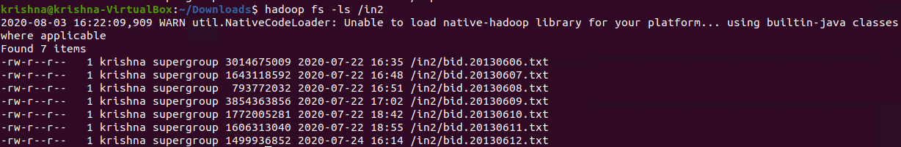
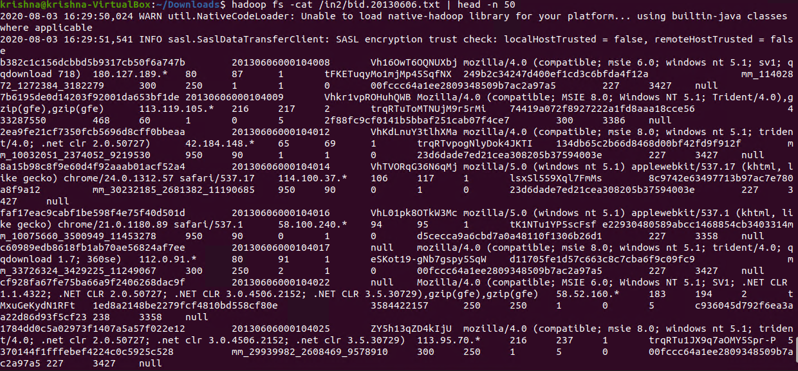
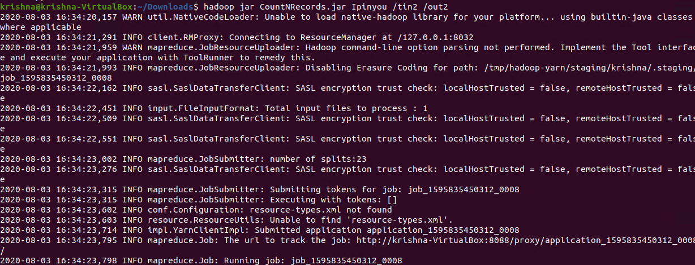
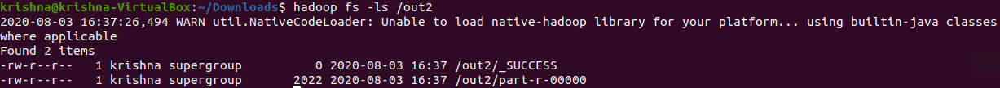
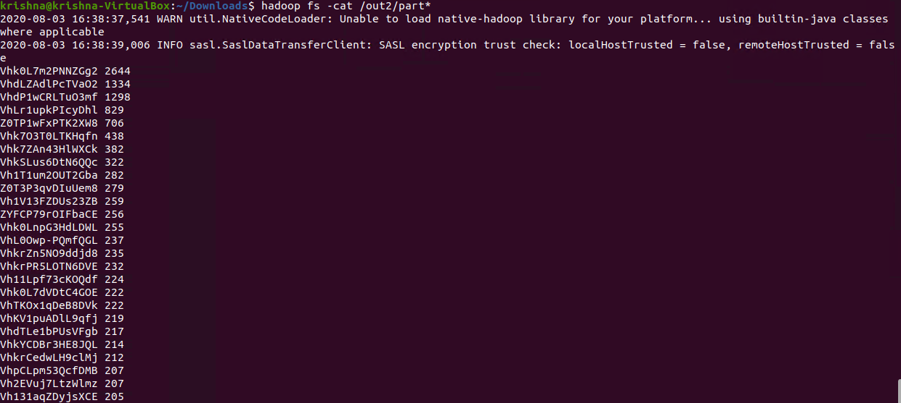
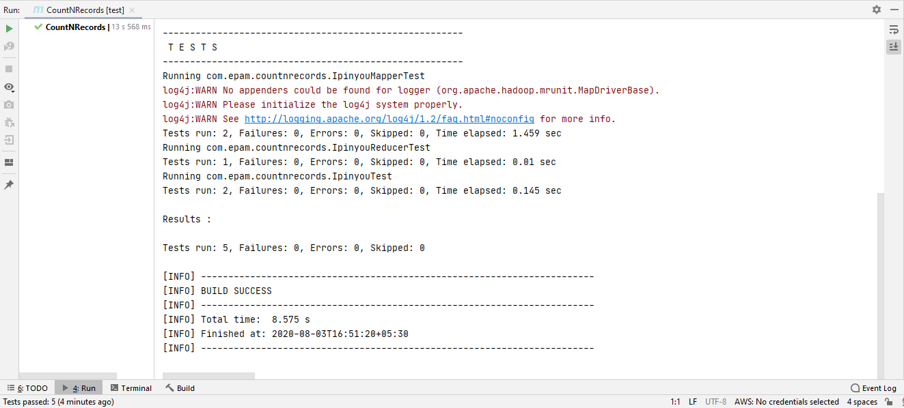

# Mapreduce Count Top N records on the basis of *iPinyouID*
-----------------------

## MapReduce

* Data processing layer in Hadoop. 
* Processing structured & Unstructured Data in Hadoop.

## Pros

* Best Performance 

## Cons 

* Hard to Extend 
* Lack of management tools
* Not suitable for real time processing
* very small community

## Input Directory

Input directory contains input files that will be processed by MapReduce to get Top-100 records on the basis of count amount of records for each *iPinyouID*.

  

In the above screenshot, we can see an input directory (in) contains 7 input files :
1.	bid.20130606.txt
2.	bid.20130607.txt
3.	bid.20130608.txt
4.	bid.20130609.txt
5.	bid.20130610.txt
6.	bid.20130611.txt
7.	bid.20130612.txt  

## bid.20130606.txt
 
  
 
In the above screenshot, we can see the content of the input file.  

## Executing Hadoop Jar

  
 
In the above screenshot, we can see the command to to get Top-100 records on the basis of count amount of records for each *iPinyouID*.  
<b>hadoop jar:</b> This is command used to execute Hadoop jar  
<b>CountNRecords.jar:</b> Hadoop jar file name  
<b>CountNRecords:</b> jar class name contains main().  
<b>/in:</b> Input directory contains file to process  
<b>/out:</b> Ouput directory will be created after execution of this command  

## Output Directory

Output directory will be automatically created contains output files.
 
  

## Read output file Content:

  
 
In the above screenshot, we can see the output contains Top-100 records.  

## Test Cases:

  
 
In the above screenshot, we can see that all 5 test cases have passed.  

**Created by:**  
**Name: Krishna Kumar Singh**  
**Email: krishnaai265@gmail.com**  
**Phone: +91-9368754996** 
